# SABA 服务端架构（Agent 核心模块视角）

> 面向架构阅读的图示化说明 · 实现与 `docs/specs-ai-native/01-architecture.md` 对齐  
> 更新：2026-05-18

**阅读主线**：本文以智能体 **「感知 → 决策 → 执行 → 学习」闭环** 组织说明（§2）；§3 起为八大模块与部署等补充图示。

---

## 2. 感知 – 决策 – 执行 – 学习闭环（核心）

SABA 是 **判断型 Agent（Judgment Agent）**：每一轮用户输入走完整闭环；**学习**不依赖在线训练，而是 **trace + 反馈 + evaluation harness** 驱动规则、提示词与知识的迭代。

### 2.1 闭环总览

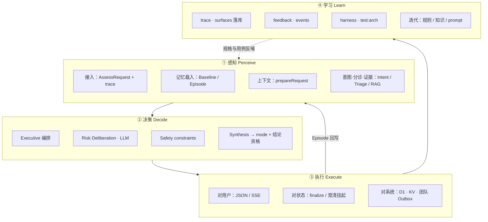

| 环节 | 回答的问题 | 对应 Agent 模块 | 闭环中的位置 |
|------|------------|-----------------|--------------|
| **感知** | 用户说了什么？临床上下文是什么？缺什么信息？ | ②记忆 ③上下文 ④工具 ①模型 | 每轮入口 |
| **决策** | 风险多高？能否下结论？对用户采用哪种交互模式？ | ⑦编排 ①模型 ⑤安全 | 核心认知 |
| **执行** | 把判断变成用户可行动作与系统侧持久化 | ⑥人机交互 ②记忆 | 对外生效 |
| **学习** | 如何从真实运行与反馈中改进 | ⑧可追溯 ⑤回归 | 跨轮、离线 |

---

### 2.2 感知（Perceive）

**目标**：把非结构化的患者叙述，变成带临床记忆、可审计的 **结构化认知输入**（非裸 chat log）。

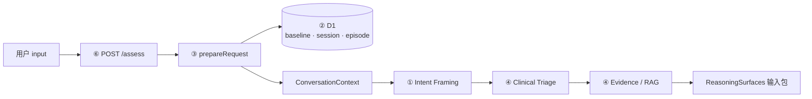

| 实现步骤 | 做什么 | 具体实现 | 技术选型 |
|----------|--------|----------|----------|
| **输入接入** | 接收本轮症状描述与治疗上下文 | `AssessRequest`（`user_id`, `input`, `context`, 可选 `session_id` / `episode_id`） | HTTP JSON；流式走 `POST /api/v1/assess/stream`（SSE） |
| **Trace 注入** | 关联一次用户旅程 | `createTraceContext` / 请求头 `X-Trace-Id`, `X-Span-Id` | `src/lib/trace.ts` |
| **记忆载入** | 恢复临床连续性 | `ConversationStateService.prepareRequest()` 读/建 Session、Episode；`PatientBaselineRepository` | **Cloudflare D1**（`sessions`, `episodes`, `patient_baselines`） |
| **上下文合并** | 治疗档案进入本轮 context | `mergeBaselineIntoContext()`、`isBaselineComplete` | TypeScript 领域逻辑 · `src/lib/patient-baseline.ts` |
| **意图感知** | 是否急症、是否 follow-up、是否可回答 | `createIntentFramer().frame()` → `IntentFramingSurface` | **LLM structured JSON**（Claude / Qwen via `llm-config.ts`） |
| **临床图景** | 症状标准化、规则倾向、关键未知项 | `createClinicalTriage().assess()` | **规则 + 症状解析**（`clinical-triage.ts`）；规则库作底线输入 |
| **证据感知** | 按需检索循证片段 | `createEvidenceRetrievalTool().retrieve()` | **本地 RAG**（`src/rag/retriever.ts`，`docs/knowledge/`，`RAG_ENABLED`） |

**感知产出物**（供决策消费）：

- `PreparedConversationState`（session、episode、合并后的 request）  
- `IntentFramingSurface`、`TriageAssessmentSurface`、`EvidenceRetrievalSurface`  
- 若信息不足：短路为「需澄清」，**不进入完整审议**

**设计要点**：Episode 记录 `symptoms.reported/extracted`、`unresolved_uncertainties`、`clarification_state`，使「更严重了」等 follow-up 有指代对象。

---

### 2.3 决策（Decide）

**目标**：在安全边界内，形成 **可发布的判断**（风险等级 + 结论资格 + 交互模式），且过程可审计。

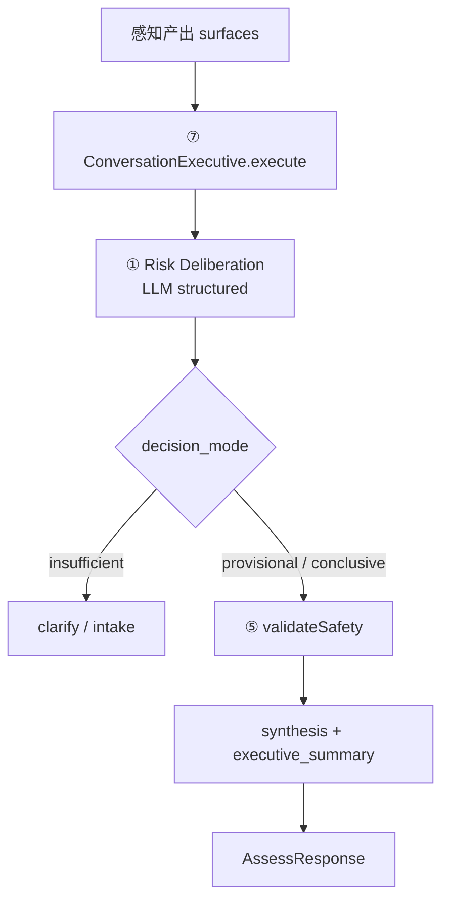

| 实现步骤 | 做什么 | 具体实现 | 技术选型 |
|----------|--------|----------|----------|
| **编排调度** | 决定走短路还是完整链 | `conversation-executive.ts`：急症 `escalation`、越界 `route_out`、基线不全强制澄清 | **中心化 DAG**（TypeScript 编排，非 Agent 互聊） |
| **风险审议** | 综合 framing + triage + evidence 定级 | `createRiskDeliberation().deliberate()` → `RiskDeliberationSurface` | **LLM**；runtime：`structured` / `tool_native`（`resolveDeliberationRuntime`） |
| **结论资格** | 区分能说到什么程度 | `decision_mode`: `conclusive` \| `provisional` \| `insufficient`；映射 `ExecutiveResponseMode` | 类型契约 · `src/types/index.ts` |
| **安全约束** | 底线与禁说项 | `validateSafety()` → `constraints`（`risk_floor`, `forbidden_claims`…） | **规则 + 正则**（`safety-validator.ts`），非重做临床推理 |
| **终稿决策** | 用户可见 message 与 status | `synthesizeExecutiveResponse()` + `executive_summary` | 当前以 **模板合成** 为主（`executive-synthesis.ts`）；constraints 注入 synthesis 链 |

**决策原则**（架构级）：

- 规则与 RAG **不单独定级**；LLM 审议 + Safety floor 共同约束。  
- 仅 Executive 路径产生 **对用户可见** 的 `immediate_action` / mode。  
- Runtime SoT：`executive_summary` + `reasoning_surfaces`（`architecture-invariants.ts` 校验）。

---

### 2.4 执行（Execute）

**目标**：让决策 **对患者可用、对系统可延续、对团队可触达**。

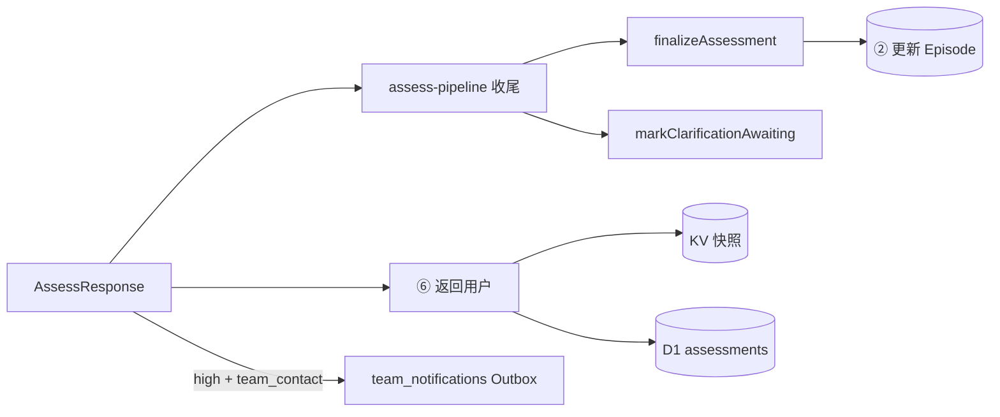

| 实现步骤 | 做什么 | 具体实现 | 技术选型 |
|----------|--------|----------|----------|
| **对用户输出** | 展示结论或追问 | `POST /assess` JSON；或 SSE：`pipeline_step` / `message` / `error` | **REST + SSE**（`assess-stream.ts`）；React 对话 UI |
| **模式落地** | 澄清 / 暂定 / 结论 / 升舱 | `executive_summary.status` + `final_mode`；前端据 status 渲染 | 有限 **state machine**（非自由生成 UI） |
| **Episode 写回** | 症状、评估记录、澄清 TTL | `finalizeAssessment()` / `markClarificationAwaiting()` | **D1**；仅 `ConversationStateService` 写 Session/Episode |
| **评估持久化** | 可查询历史与审计 | `AssessmentRepository.create()`；生产另 `ASSESSMENTS_KV.put` | **D1 + Cloudflare KV**（KV ~30d TTL） |
| **澄清轮** | 不误导为「已评估完成」 | `clarification_required` 时不写完整 assessment 行（`shouldPersistAssessment`） | 派生状态，真相在 `executive_summary.status` |
| **团队侧执行** | 高风险通知入队 | `POST /api/v1/team/notify` → `team_notifications` | D1 **Outbox** 表；dispatch 待完善 |
| **行为埋点** | 产品分析 | `POST /api/v1/events` → `assessment_events` | D1 + `trace_json` |

**执行边界**：输出为「就医 / 联系团队 / 观察」类行动建议，**不包含**诊断、剂量、停药改药（⑤ 在决策阶段已拦截）。

---

### 2.5 学习（Learn）

**目标**：从运行数据 **可追溯地改进** 系统行为；**不做** 模型权重在线更新，采用 **Spec-as-Code + harness 回归**。

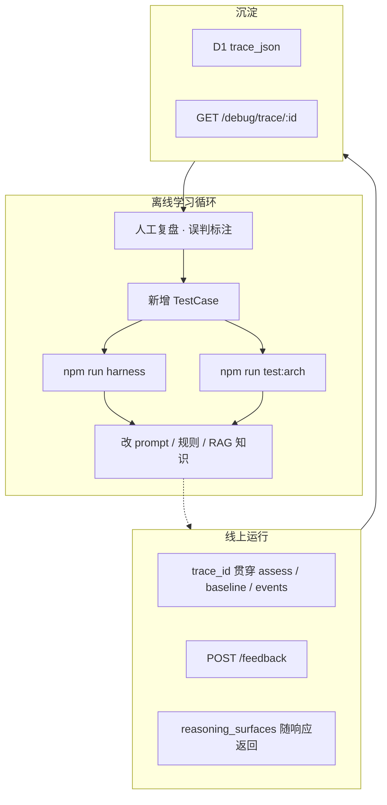

| 实现步骤 | 做什么 | 具体实现 | 技术选型 |
|----------|--------|----------|----------|
| **全链路追溯** | 一次旅程可聚合 | `TraceContext`；D1 `trace_json`；`TraceRepository.getTraceChain` | `src/lib/trace.ts`、`trace-chain.ts` |
| **推理可复现** | 知悉每步依据 | 响应内 `reasoning_surfaces`；SSE `pipeline_step` | JSON 结构化 surface，非黑盒单字符串 |
| **人类反馈** | 是否有帮助、是否就医 | `feedback` 表 · `POST /api/v1/feedback` | **D1** |
| **场景回归** | P0 场景不退化 | `evaluation-harness.ts`（red_flag、insufficient_info、spec7…） | **Vitest + tsx**（`npm run harness`） |
| **架构门禁** | 契约不被破坏 | `checkAssessResponseArchitecture()` | **Vitest**（`npm run test:arch`） |
| **知识/规则迭代** | 循证与底线更新 | `docs/knowledge/`、`rule_versions` 表（预留） | 静态知识 + 版本化部署 |
| **开发流程** | 先测后码 | 新行为先加 harness case（`AGENTS.md`） | **Spec-driven**，非 RLHF |

**闭环如何闭合**：

```text
执行阶段写入 trace / assessment / Episode
    → 学习阶段：复盘 → 新 harness case → 调 ①提示词 / ④知识 / ⑤规则
    → test:arch + harness 通过 → 部署
    → 下一轮「感知」加载的知识与规则已更新，对患者行为改善
```

**当前未做**：基于 feedback 的自动 prompt 优化、在线 A/B 模型路由。

---

### 2.6 闭环与单次评估时序（对照）

将四环节叠在同一时序上，便于与 §4 对照阅读：

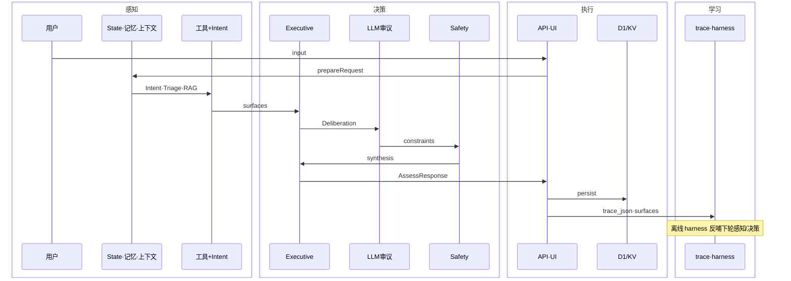

---

## 3. 系统上下文（C4 · Context）

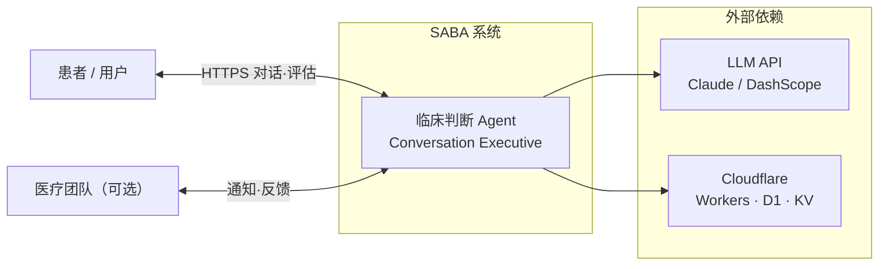

**边界**：SABA 做副作用风险判断与保守建议；**不**诊断、**不**开药、**不**替医嘱。

---

## 4. 部署与运行时（C4 · Container）

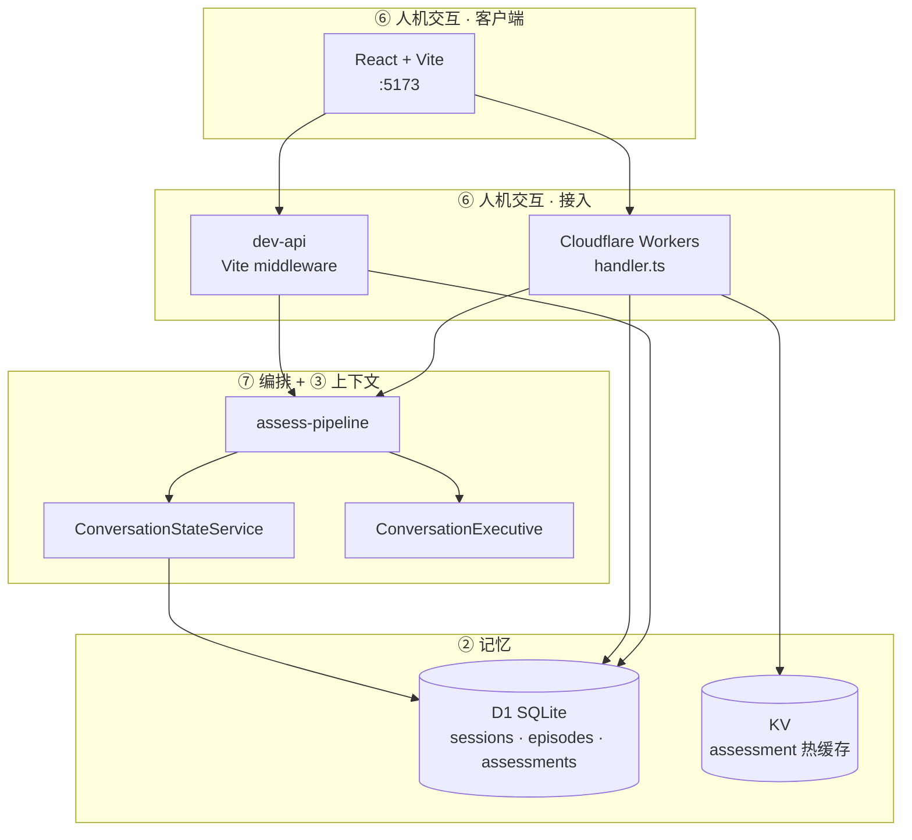

| 环境 | 接入路径 | 存储 |
|------|----------|------|
| 本地 | Vite `5173` → dev-api → pipeline | 本地 D1（`npm run d1:local:init`） |
| 生产 | Workers → pipeline | D1 + KV |

---

## 5. Agent 八大模块总图

八大模块在一次评估中的**协作关系**（箭头表示数据/控制流向）：

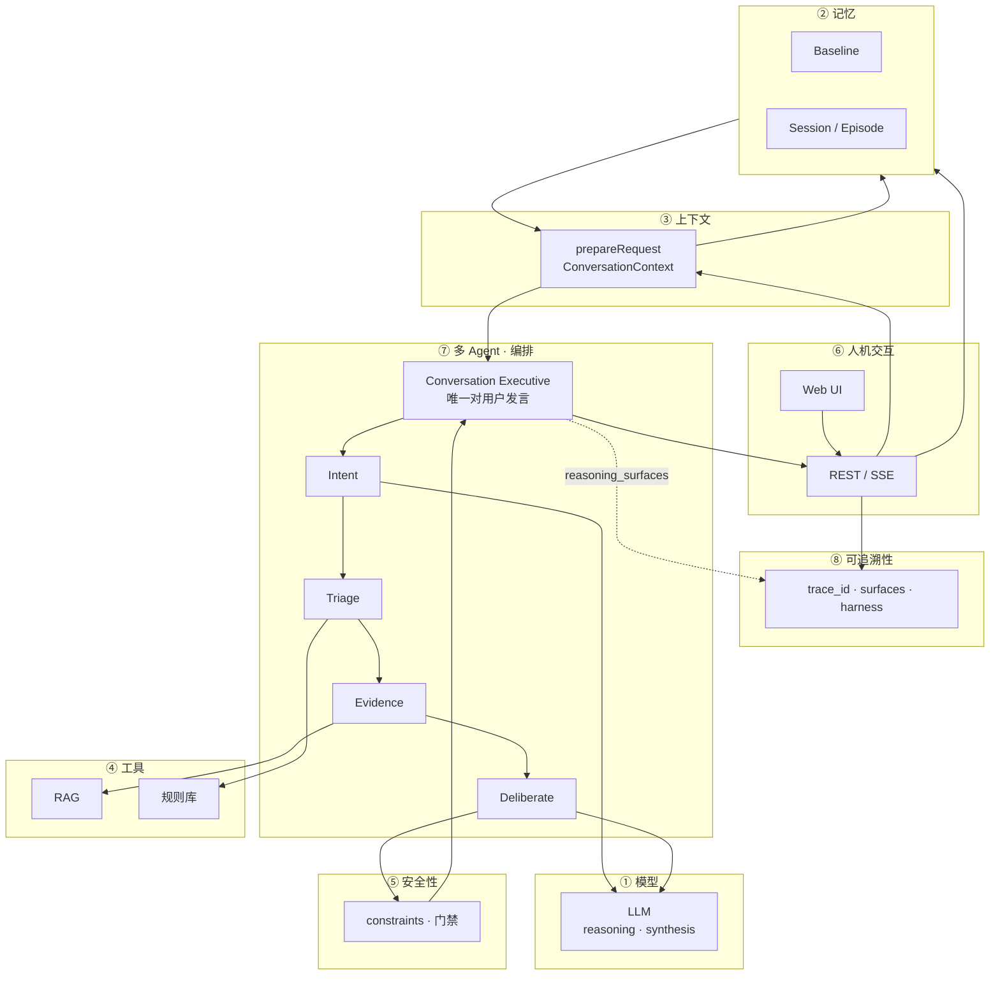

### 模块速查

| # | 模块 | 在本系统中的职责 | 关键代码 |
|---|------|------------------|----------|
| ① | **模型** | LLM 结构化推理与合成 | `llm-config.ts`, `intent-framing.ts`, `risk-deliberation.ts`, `executive-synthesis.ts` |
| ② | **记忆** | Baseline + Episode 临床连续性 | `conversation-state.ts`, `conversation-repository.ts`, D1 |
| ③ | **上下文** | 每轮组装可推理上下文包 | `prepareRequest`, `types/index.ts` |
| ④ | **工具** | RAG / 分诊 / 规则（无终审权） | `clinical-triage.ts`, `evidence-retrieval.ts`, `rag/` |
| ⑤ | **安全性** | constraints、基线门禁、架构不变量 | `safety-validator.ts`, `architecture-invariants.ts` |
| ⑥ | **人机交互** | API、SSE、有限 response mode | `handler.ts`, `dev-api/`, `components/` |
| ⑦ | **多 Agent** | 单 Executive 编排，推理单元只产 surface | `conversation-executive.ts`, `modules/` |
| ⑧ | **可追溯性** | trace、落库、评测回归 | `trace.ts`, `evaluation-harness.ts` |

---

## 6. 单轮评估：时序与数据流

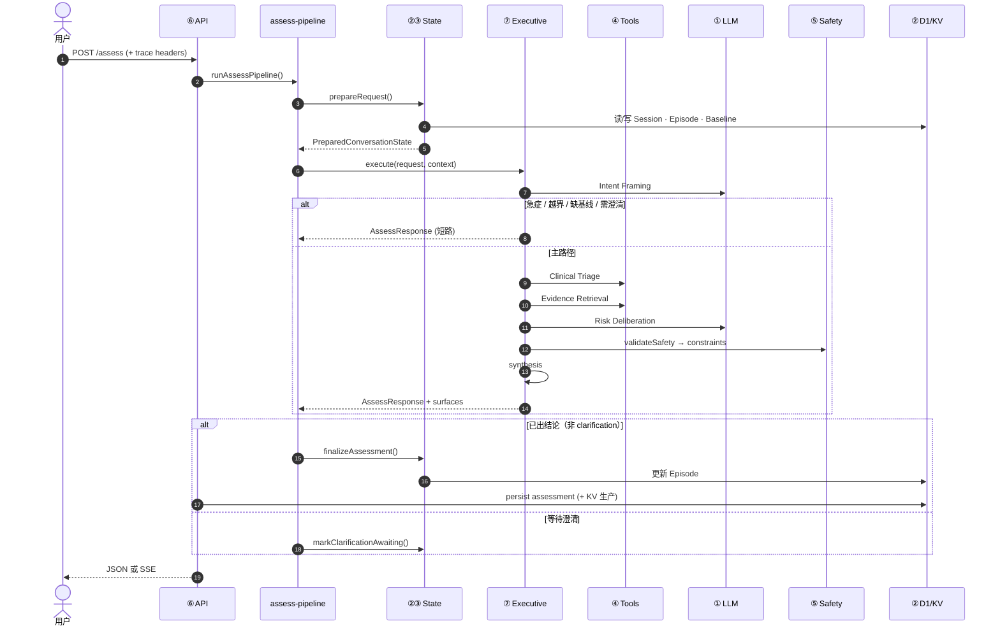

**三条架构约束**（图示中应始终成立）：

1. 用户可见文案 **只** 来自 Executive（⑦ → ⑥）。  
2. 推理单元 **只** 写 `reasoning_surfaces`，不写终稿（⑦ 内部）。  
3. Session/Episode **只** 由 `ConversationStateService` 写 D1（②，不经 Executive）。

---

## 7. ⑦ 多 Agent：编排 DAG（非互聊）

逻辑上是「多推理单元」，物理上是 **Executive 中心化 DAG**；单元之间 **不** 用自然语言互相对话。

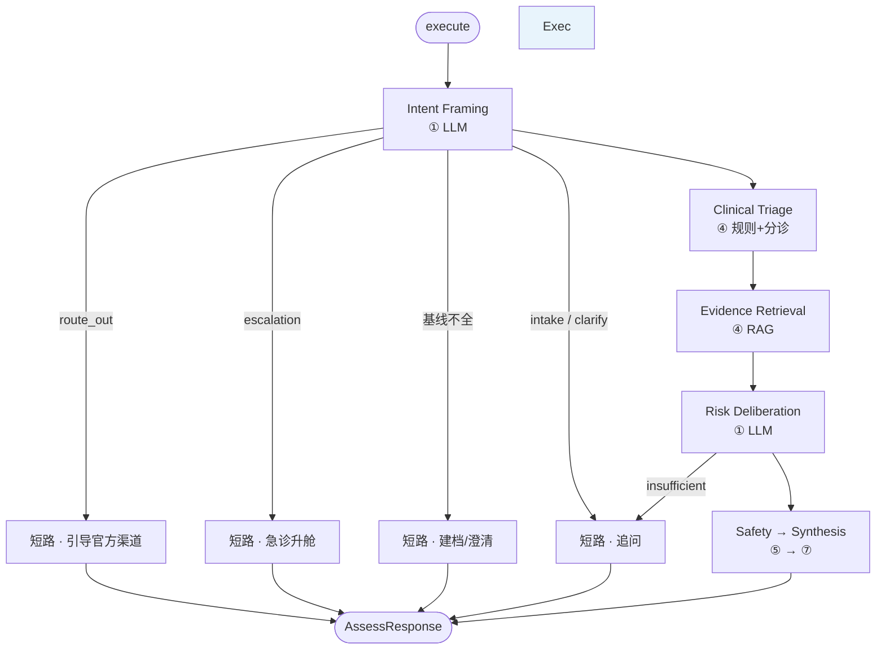

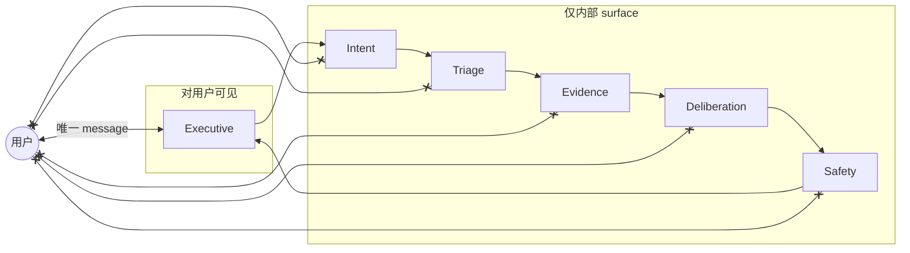

| 角色 | 对用户说话 | 产出 |
|------|------------|------|
| Conversation Executive | ✅ | `AssessResponse`, `executive_summary` |
| Intent / Triage / Deliberation | ❌ | 各 `*Surface` |
| Evidence / RAG | ❌ | `EvidenceRetrievalSurface` |
| Safety | ❌ | `SafetyConstraintSurface` |

---

## 8. ② 记忆：分层结构

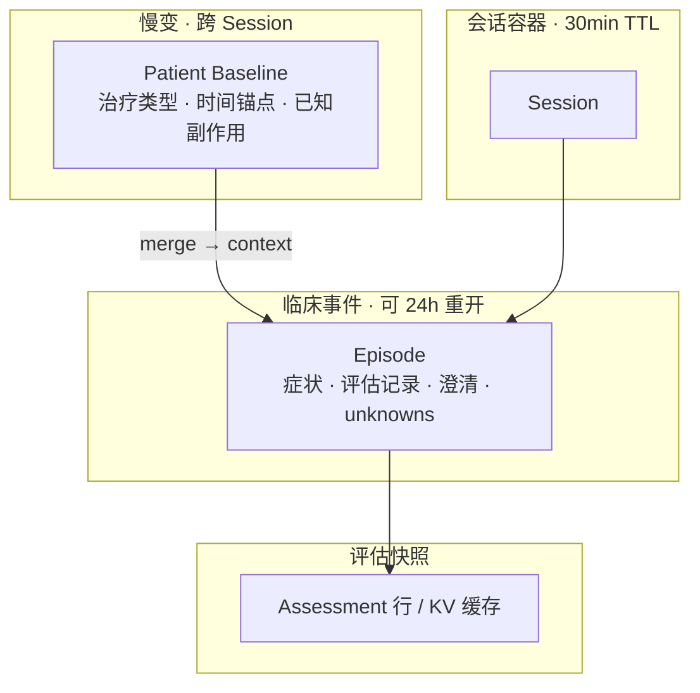

| 层 | 回答的问题 | D1 表 |
|----|------------|-------|
| Baseline | 这名患者处在什么治疗背景？ | `patient_baselines` |
| Session | 当前对话窗口是否有效？ | `sessions` |
| Episode | 正在判断哪一次临床事件？ | `episodes` |
| Assessment | 哪次评估落库、可审计？ | `assessments` (+ KV) |

---

## 9. ③ 上下文：组装与传递

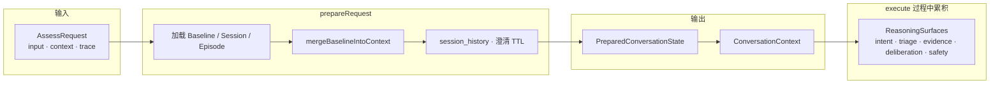

模块间 **不** 传递裸 chat history 作为主契约；主契约是 **Episode 字段 + surfaces**。

---

## 10. ① 模型 · ④ 工具 · ⑤ 安全：三角关系

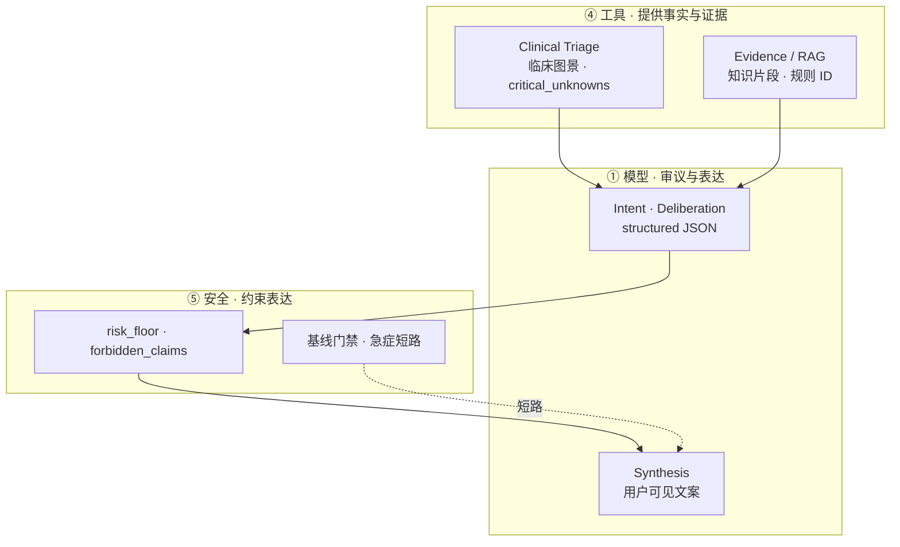

| 阶段 | 模块 | 说明 |
|------|------|------|
| reasoning | ① | Intent、Deliberation 调 LLM，输出 surface |
| — | ④ | 不调 LLM 或轻量；为审议提供输入 |
| critique | ⑤ | `validateSafety` → constraints |
| synthesis | ①+⑦ | constraints 注入后生成 message |

---

## 11. ⑥ 人机交互：协议与模式

### 11.1 API 面

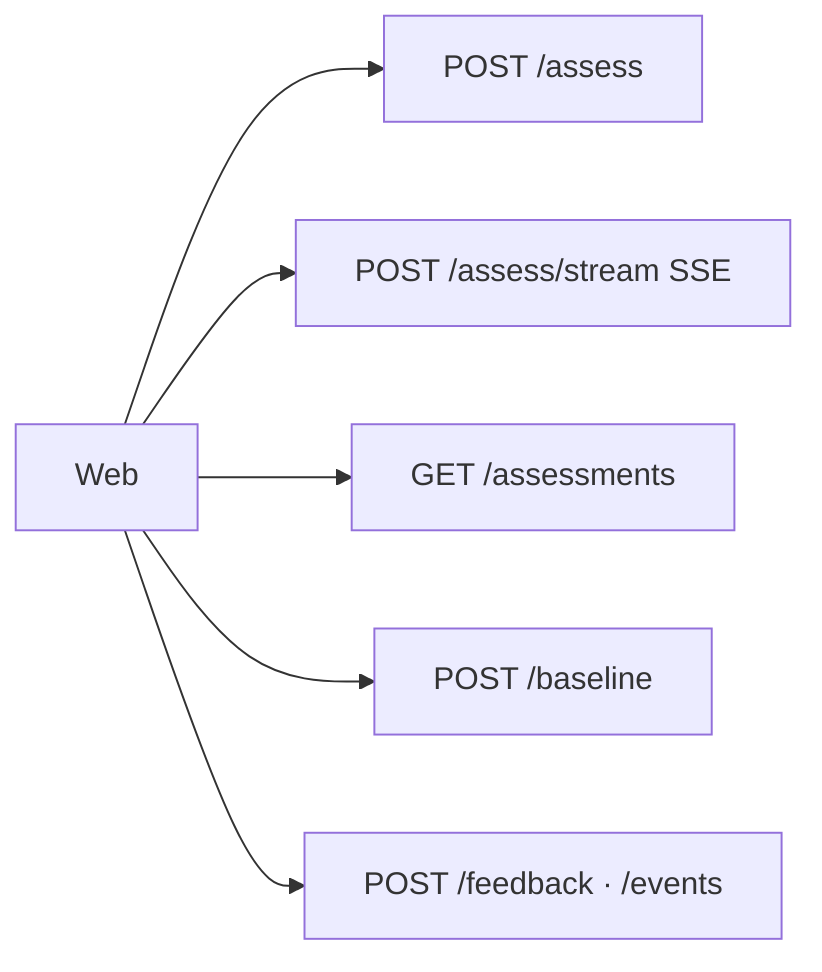

### 11.2 用户可见模式（有限集合）

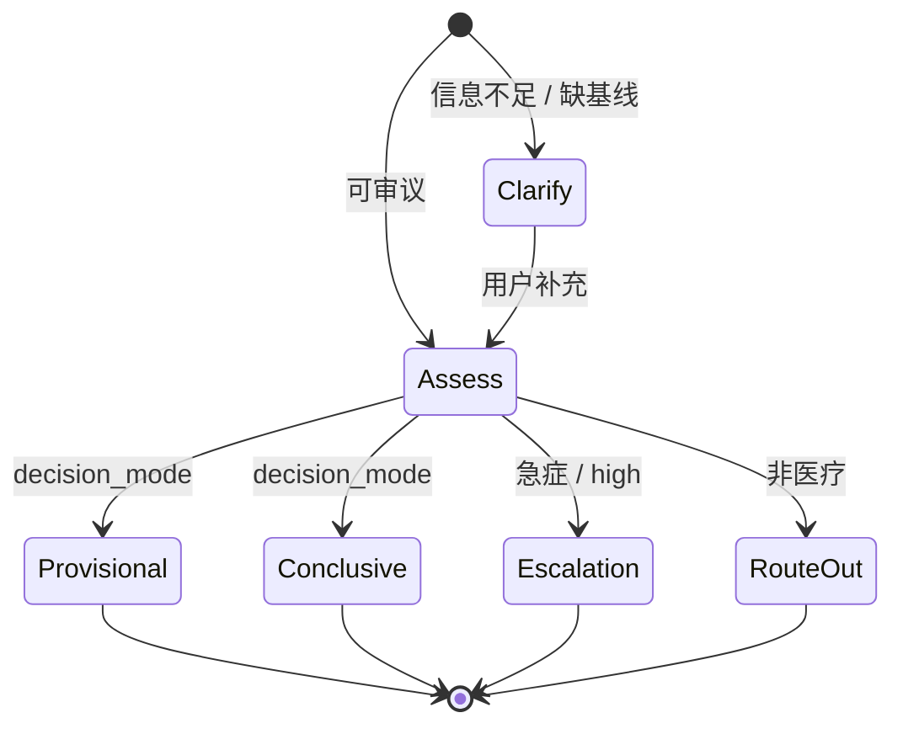

状态 **真相源**：`executive_summary.status` + `final_mode`（非独立 `clarification_required` 字段）。

### 11.3 流式事件（SSE）

| 事件 | 含义 |
|------|------|
| `pipeline_step` | intent / triage / deliberation / safety 进度 |
| `thinking` | 审议中间态 |
| `message` | 面向用户的片段 |
| `error` | 失败 |

---

## 12. ⑧ 可追溯性（支撑学习环节）

与 §2.5 衔接：trace 落库、harness 回归、debug 聚合。命令：`npm run test:arch`、`npm run harness`。

---

## 13. 八大模块说明（简表）

### ① 模型

- **职责**：结构化推理（Intent、Deliberation）与 synthesis。  
- **Provider**：`anthropic` / `dashscope`（`env.ts`）。  
- **原则**：审议定 `decision_mode` / `risk_level`；不用关键词 alone 定级。

### ② 记忆

- **职责**：Baseline（慢）+ Episode（快）+ Assessment 持久化。  
- **写入口**：仅 `ConversationStateService`。  
- **本地**：`npm run d1:local:init`。

### ③ 上下文

- **职责**：`prepareRequest` 产出 `PreparedConversationState`；轮内累积 `ReasoningSurfaces`。

### ④ 工具

- **职责**：分诊、RAG、规则匹配；**无**最终风险裁决权。  
- **调用序**：Triage → Evidence → Deliberation 消费。

### ⑤ 安全性

- **职责**：constraints、产品边界、基线门禁、arch/harness 门禁。  
- **原则**：安全在 synthesis **之前**，非事后改错别字。

### ⑥ 人机交互

- **职责**：API/SSE/UI、有限 mode、反馈与团队通知。  
- **端口**：本地固定 `5173`（`strictPort`）。

### ⑦ 多 Agent

- **职责**：单 Executive 编排；推理单元 surface-only。  
- **见**：§7 编排 DAG。

### ⑧ 可追溯性

- **职责**：trace 传播、D1 `trace_json`、harness 回归。  
- **命令**：`npm run test:arch`、`npm run harness`.

---

## 14. 相关文档

| 文档 | 内容 |
|------|------|
| [specs-ai-native/01-architecture.md](specs-ai-native/01-architecture.md) | 分层规格（Layer A–E） |
| [specs-ai-native/02-contracts.md](specs-ai-native/02-contracts.md) | 类型与 API 契约 |
| [src/storage/schema.sql](../src/storage/schema.sql) | D1 表结构 |

---

## 一句话

> **感知**（D1 记忆 + Intent/Triage/RAG）→ **决策**（Executive + LLM 审议 + Safety）→ **执行**（SSE/API + Episode 落库）→ **学习**（trace + harness 反哺）；构成 SABA 临床判断 Agent 的完整闭环。
